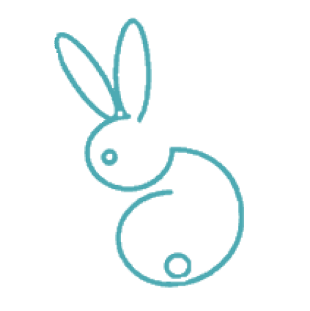

#  
# Critterism - Front End

<b>Critterism</b> is an animal trivia application with an ulterior cause that seeks to persuade animal welfare without the Sarah McLachlan guilt trip soundtrack. 

Users can sign in with Google OAuth and play a 10-question trivia game with fun animal facts. Upon completion, users are granted the option to explore animal and wildlife organizations that they can donate to. The frontend application makes API calls to the backend. Crittism is currently deployed on <a href="https://critterism-fe.herokuapp.com/">Heroku</a>. 

The <a href="https://github.com/Critterism/Critterism-BE">Back End Repo</a> can be found deployed to <a href="https://critterism-be.herokuapp.com/">Heroku</a>.

<h2> Preview </h2>

When users first visit <a href="https://critterism-fe.herokuapp.com/">Critterism</a>, they'll have an option to sign in or sign up with Google OAuth.

Upon signing in, they'll have the option to play a trivia game.

They only see one question at a time and the user will be told if they answered correctly or incorrectly when they hit submit.

When they've completed the game, they'll be presented with a choice to select animal or wildlife charities.

Once they've made a selection, they'll have a list of charities to choose from.

<!-- TABLE OF CONTENTS -->

<h2> Table of Contents</h2>

Table of Contents

  <ol>
    <li><a href="#technical-requirements"> Technical Requirements</a></li>
    <li><a href="#gems-and-tools"> Gems and Tools</a></li>
    <li><a href="installation"> Installation</a></li>
    <li><a href="#schema"> Schema</a></li>
    <li><a href="#endpoints"> Server API Endpoint</a></li>
    <li><a href="#contributors"> Contributors</a></li>
  </ol>

<!-- TECHNICAL REQUIREMENTS -->

<h2 id="technical-requirements">Technical Requirements</h2>
<ul>
<li>Ruby 2.7.4</li>
<li>Rails 5.2.8</li>
</ul>

<!-- GEMS AND TOOLS -->

<h2 id="gems-and-tools">Gems and Tools</h2>
<ul>
  <li>Bootstrap</li>
  <li>Capybara</li>
  <li>Factory Bot</li>
  <li>Faker</li>
  <li>Faraday</li>
  <li>Figaro</li>
  <li>Launchy</li>
  <li>Orderly</li>
  <li>Postman</li>
  <li>Pry</li>
  <li>Shoulda-Matchers</li>
  <li>SimpleCov</li>
  <li>VCR</li>
  <li>Webmock</li>
  <li>RSpec</li>
</ul>

<!-- INSTALLATION -->

<h2 id="installation"> </h2>

To get started, clone the repo in your terminal by entering the following:
<ul>
  <li>git clone git@github.com:Critterism/FE-Critterism.git</li>
</ul>  
   
Once cloned, run the following commands:
<ul>
  <li>bundle install</li>
  <li>rails db:create</li>
  <li>rails db:migrate</li>
  <li>Run the Figaro command: <em>bundle exec figaro install</em></li>
  <li>Update the `application.yml` file with `ENV` variables storing API keys for <em>GOOGLE_CLIENT_ID: '< your api key >'</em> and <em>GOOGLE_CLIENT_SECRET: '< your ID >'</em>. Follow the instruction on how to get started with Google OAuth <a href="https://oauth.net/getting-started/">here</a>.</li>
</ul>  

<!-- DATABASE SCHEMA -->
<h2 id="schema"> Schema</h2>

<!-- SERVER API ENDPOINT -->
<h2 id="endpoints"> Endpoints</h2>

<h4>Get Wildlife Charities</h4>
<pre>
  <code>
    "/api/v1/charities/wildlife"

    "data": {
                "id": null,
                "type": "charity",
                "attributes": {
                    "description": "The Fungi Foundation is a global organization that works for the Fungi, their habitats, and the people who depend on them.. Launched in 2012, the Fungi Foundation is the first NGO dedicated to the fungi kingdom. Since its inception, it has achieved",
                    "ein": "851478153",
                    "id": null,
                    "location": "New York, NY, USA",
                    "logo": "https://res.cloudinary.com/everydotorg/image/upload/c_lfill,w_24,h_24,dpr_2/c_crop,ar_24:24/q_auto,f_auto,fl_progressive/profile_pics/wq14eif08jx3kka2ixau",
                    "name": "Fungi Foundation",
                    "profile_url": "https://www.every.org/ffungi",
                    "slug": "ffungi",
                    "tags": [
                        "wildlife",
                        "education",
                        "climate",
                        "conservation",
                        "research",
                        "women-led",
                        "environment"
                    ]
              }
  </code>
</pre>

<h4>Get Animal Charities</h4>
<pre>
  <code>
    "/api/v1/charities/animals"

    "data": {
                "id": null,
            "type": "charity",
            "attributes": {
                "description": "The Fungi Foundation is a global organization that works for the Fungi, their habitats, and the people who depend on them.. Launched in 2012, the Fungi Foundation is the first NGO dedicated to the fungi kingdom. Since its inception, it has achieved",
                "ein": "851478153",
                "id": null,
                "location": "New York, NY, USA",
                "logo": "https://res.cloudinary.com/everydotorg/image/upload/c_lfill,w_24,h_24,dpr_2/c_crop,ar_24:24/q_auto,f_auto,fl_progressive/profile_pics/wq14eif08jx3kka2ixau",
                "name": "Fungi Foundation",
                "profile_url": "https://www.every.org/ffungi",
                "slug": "ffungi",
                "tags": [
                    "wildlife",
                    "education",
                    "climate",
                    "conservation",
                    "research",
                    "women-led",
                    "environment"
                    ]
              }
  </code>
</pre>

<h4>Get Charity by Slug</h4>
<pre>
  <code>
    "/api/v1/charities/#{slug}"
    
    "data": {
        "id": "82ea3d2e-ee6e-4e1e-b9ef-9e890ee2be88",
        "type": "charity",
        "attributes": {
            "description": "Dedicated to combatting animal cruelty and illegal animal sales through rescue efforts, public education, investigations, legislation, special events and media.",
            "ein": "263792479",
            "id": "82ea3d2e-ee6e-4e1e-b9ef-9e890ee2be88",
            "location": "LOS ANGELES, CA",
            "logo": "https://res.cloudinary.com/everydotorg/image/upload/c_lfill,w_24,h_24,dpr_2/c_crop,ar_24:24/q_auto,f_auto,fl_progressive/faja_profile/cdyalof6zfbqdmpfgdi0",
            "name": "Bunny World Foundation",
            "profile_url": "https://www.every.org/bunny-world-foundation",
            "slug": "bunny-world-foundation",
            "tags": [
                "animals"
              }
  </code>
</pre>

<h4>Get Trivia Questions</h4>
<pre>
  <code>
    "/api/v1/trivia"

    "data": {
            "id": null,
            "type": "trivia",
            "attributes": {
                "category": "Animals",
                "type": "boolean",
                "difficulty": "easy",
                "question": "The Axolotl is an amphibian that can spend its whole life in a larval state.",
                "correct_answer": "True",
                "incorrect_answers": [
                    "False"
                ]
            }
  </code>
</pre>

<!-- CONTRIBUTORS -->
<h2 id="contributors"> Contributors</h2>

<h3>Anna Marie Sterling</h3>

<h3>Nicole Esquer</h3>

<h3>Nikky Rojas</h3>

<h3>Sunny Moore</h3>

<!-- MARKDOWN LINKS & IMAGES -->

[Bootstrap]: https://img.shields.io/badge/bootstrap-%23563D7C.svg?style=for-the-badge&logo=bootstrap&logoColor=white

[Rails]: https://img.shields.io/badge/rails-%23CC0000.svg?style=for-the-badge&logo=ruby-on-rails&logoColor=white
[Rails-url]: https://rubyonrails.org/

[Atom]: https://img.shields.io/badge/Atom-66595C?style=for-the-badge&logo=Atom&logoColor=white
[Atom-url]: https://atom.io/

[Ruby]: https://img.shields.io/badge/Ruby-000000?style=for-the-badge&logo=ruby&logoColor=CC342D
[Ruby-url]: https://www.ruby-lang.org/en/

[RSpec]: https://img.shields.io/badge/RSpec-fffcf7?style=for-the-badge&logo=data:image/svg+xml;base64,PHN2ZyB2ZXJzaW9uPSIxLjEiIHhtbG5zPSJodHRwOi8vd3d3LnczLm9yZy8yMDAwL3N2ZyIgd2lkdGg9IjUxMnB4IiBoZWlnaHQ9IjUxMnB4Ij48cGF0aCBkPSJNMzIyLjM4NDE4NTgsMTQ1LjU3NTY2ODNsNjguNTQ4NjQ1LDcwLjI4NDA1NzZsLTE3LjM1NDA5NTUsMzEuNjcxMjE4OUwyNTQuMjY5MzYzNCwzOTYuNzc2MDkyNUwxMzQuOTYwMDA2NywyNTEuMDAxNzU0OGwtMTcuMzU0MDgwMi0zNS4xNDIwMjg4bDY4LjU0ODY2MDMtNzAuMjg0MDU3NkgzMjIuMzg0MTg1OHogTTMwMC4yNzUzMjk2LDM2LjAwOTgyNjdsLTI1LjY3NTQxNSwzMy45NDQ4MzE4QzM5OC4wMTA4MzM3LDgyLjAzMDUzMjgsNDcyLjA5NzI5LDIwNy45MTIxMzk5LDQzMy4wNDE5MzEyLDMxOC4zMzk0NDdsMTkuODc0ODE2OSwzOS41Mjg2ODY1bDM5LjQ5NTAyNTYtMi45ODkxNjYzQzU1Ny4zNDYxMzA0LDIwMC42MTA2NDE1LDQ1NC4zMTExNTcyLDE3LjkzMzU3NjYsMjc5LjY4MDI2NzMsMS43NTU0NzY2TDMwMC4yNzUzMjk2LDM2LjAwOTgyNjd6IE0xNy41ODYxOTg4LDM0OC42OTE4OTQ1Qy00OC41MzY1OTQ0LDE4MC4zMTU1NjcsODAuMTU4NDMyLTUuNDMyNjY5MiwyNjMuOTI0MzQ2OSwwLjc1NTQ1NDZsMjAuNjk2MDE0NCwzNC40MjIxNTczbC0yNS42MjQyMDY1LDMzLjg3NjY2MzJDMTI0LjMyMjk5OCw2Ni42NDI2OTI2LDMxLjA5Nzk1OTUsMjA1LjE3MjI3MTcsODMuMzY0Mjk2LDMyOC43OTgwMzQ3bC00Mi43NzA3NTk2LTExLjIyMTUyNzFMMTcuNTg2MTk4OCwzNDguNjkxODk0NXogTTQ4Ni4yOTQxMjg0LDM2OC4zNjY2MzgybC00MS4wNzMxNTA2LDMuMTA4NjEyMWwtMTguNjY3NTQxNS0zNy4xMjcyMjc4Yy01NC4xMDkzNDQ1LDEyNC44ODMzMDA4LTI1MC41ODg0NzA1LDE2Mi4xODEwMzAzLTMzNS45MDgyNjQyLDkuNzg3MTcwNGwtNDQuODM4ODU1Ny0xMS43NjQyMjEybC0yMi4zMDExNjA4LDMwLjE2MDAwMzdDMTI4LjAxMDc0MjIsNTc2LjQ1Mjc1ODgsNDA1LjA3OTU4OTgsNTQzLjE1MTI0NTEsNDg2LjI5NDEyODQsMzY4LjM2NjYzODJ6Ii8+PC9zdmc+
[RSpec-url]: https://rspec.info/

[PostgreSQL]: https://img.shields.io/badge/PostgreSQL-316192?style=for-the-badge&logo=postgresql&logoColor=white
[PostgreSQL-url]: https://www.postgresql.org/

[Postman]: https://img.shields.io/badge/Postman-FF6C37?style=for-the-badge&logo=postman&logoColor=white
[Postman-url]: https://web.postman.co/

[bcrypt-docs]: https://github.com/bcrypt-ruby/bcrypt-ruby
